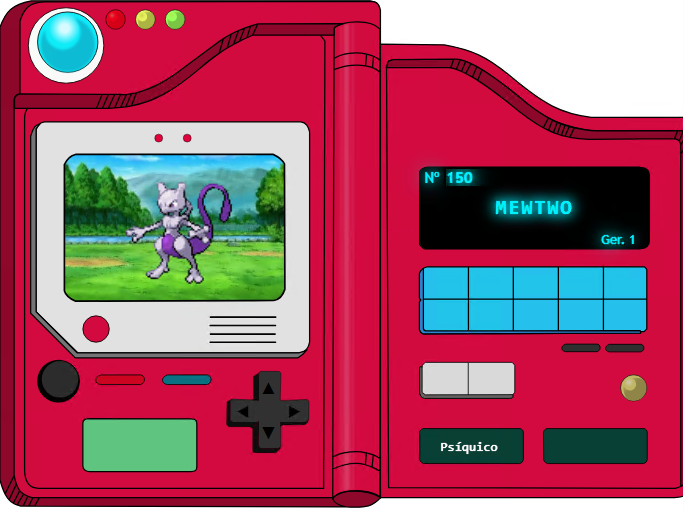
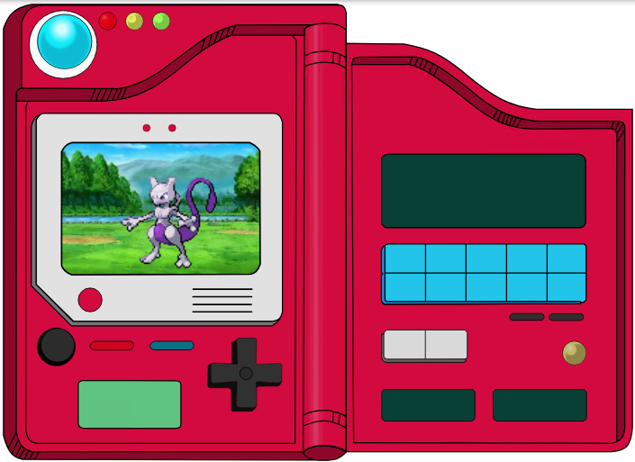
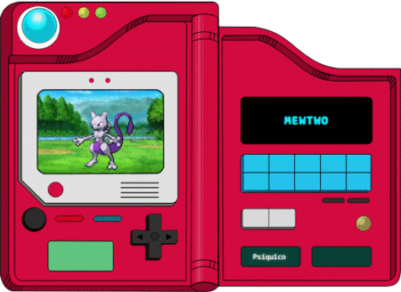

# PokeAPI Visualizar Pokemon diretamente na Pokedex - Projeto em Angular + Ionic

Este projeto tem como objetivo estudar e implementar uma aplicação que consome a [PokéAPI] (https://pokepai.co/) e apresenta os dados de forma visual e organizada. A aplicação está sendo construída com **Angular standalone** e **Ionic Framework**, ambos utilizados pela primeira vez neste contexto de estudo e evolução de habilidades como engenheiro de software.

---

## Tecnologias utilizadas

- [Angular](https://angular.dev/)(Standalone Components)
- [Ionic Framework](https://ionicframework.com/)
- [PokéAPI](https://pokeapi.co/) - API RESTful pública

---

## Objetivo

> Criar uma base funcional para consumir dados da PokéAPI e exibir os dados do Pokémon **Mewtwo**, testando layout, estrutura e recursos do Angular standalone + Ionic.

---

## Evolução do projeto

O projeto está em desenvolvimento e passou pelas seguintes etapas:

1. Criação do projeto standalone com Angular + Ionic
2. Consumo da API para buscar um Pokémon fixo
3. Integração do payout viual da Pokédex com a imagem do pokémon
4. Implementação da navegação entre seções: nome, altura/peso/habilidades e status
5. Adição de botões verticais para navegação sequencial entre os Pokémons via ID 
6. Implementação de numeração dinâmica com campo de busca, exibição da geração do Pokémon e efeito visuais retrô no display principal
7. Implementação do filtro por geração, permitindo seleção e exibição de Pokémon por geração

---

## Interface Atual

Abaixo está uma prévia do layout atualizado:

---

## Integração do Layout Visual e Renderização do Pokémon

Avançmos com a integração visual da Pokédex clássica ao projeto. Essa etapa envolveu a inserção do layout gráfico inspirado no Pokédex original, o posicionamento do diplay e a renderização da imagem do Pokémon.

**Detalhes implementados**

- Layout da Pokédex adicionado com uso da imagem SVG responsiva.
- Criação de container centralizado para exibir o Pokémon.
- Poicionamento aboluto e etilização do diplay da Pokédex.
- Renderização da imagem do Pokémon (Mewtwo) com ajuste de escala e preservação da qualidade visual.

## Interface Inicial

Abaixo está uma prévia do layout implementado com o Pokémon exibido corretamente:

---

## Paginação de Dados do Pokémon

- **Página 1:** Nome do Pokémon (formatação em caixa alta).
- **Página 2:** Altura, peso e habilidades exibidas de forma clara e alinhada.
- **Página 3:** **Status Base** do Pokémon (HP, Ataque, Defesa, etc.), organizados em duas colunas, melhorando a visualização e respeitando o estilo das Pokédex clássicas.

A navegação foi construída com a diretiva `*ngSwitchCase`, controlando o conteúdo renderizado com base no índice da página atual. Esse mecanismo garante uma renderização eficiente, estruturada e de fácil manutenção.

## Interface com Paginação

Abaixo está uma demonstração em tempo real da navegação entre páginas da Pokédex:

---

## Navegação Sequencial entre Pokémons

Como parte do aprimoramento da experiência de usuário e da simulação da navegação de uma Pokédex clássica, foi implementado um sistema de **navegação vertical sequencial** que percorre os registros da [PokéAPI](https://pokeapi.co) de forma incremental.

Essa funcionalidade permite que o usuário avance (&#9660;) ou retorne (&#9650;) entre os Pokémons utilizandfo os botões direcionais, atualizando dinamicamente as informações exibidas com base no ID atual do pokémon.

**Detalhes implementados:**

 - Controle de ID do Pokémon através de uma variável `pokemonID`, iniciando em 1 (Bulbasaur)
 - Botões (&#9660;) e (&#9650;) atualizam o pokemonId e disparam a função `getPokemon()` para buscar os dados atualizados 
 - Reutilização da lógica de exibição mantendo a consistência com as demais seções da Pokédex
 - O total de Pokémons disponiveis é obtido dinamicamente a partir do endpoint `https://pokeapi.co/api/v2/pokemon?limit=1`, capturando o valor da propriedade `count` e armazenado na variável `totalPokemons`
 -  A navegação agora respeita dinamicamente esse limite superior (`totalPokemons`), garantindo que a aplicação continue funcional mesmo após futuras atualizações da PokéAPI, aumentando a resiliência e reduzindo a necessidade de manutenção manual

---

## Campo Numérico e Geração

Como parte da evolução da Pokédex, foi criada uma seção focada em acesso direto, clareza informativa e imersão visual, com destaque para geração do Pokémon e input de busca rápida.

- Campo numérico de busca rápida permite que o usuário digite o número (ID) de qualuqer pokémon para acessá-lo instantaneamente, otimizando a navegação e reduzindo o número de cliques

- Exibição da geração, exibe a geração do pokémon de forma clara e resumida, no formato Ger.1, Ger. 2, etc. A informação é obtida por meio da API `pokemon-species` e apreentada ao lado do nome do pokémon no diplay principal

- Conversão automática é uma resposta textual da API (`generation-i`, `generation-ii`, etc.) convertido automaticamente para um número legivel pelo uuario por meio de um mapeamento interno, mantendo a apresentação simp;les e conistente

- Validação de input, o campo numérico não aceita valore fora do intervalo válido(entre 1 e o total de pokémons disponiveis na API), garantindo robustez e evitando falhas ou resultados inválidos.

---

## Padrão de Projeto Utilizado

Neste projeto, estou utilizando a **standalone Component Architecture** do Angular. Tem me ajudado bastante por alguns motivos:

- Permite maior **modularidade** e o uso de **carregamento assíncrono** com `loadComponent`
- Reduz a dependência do `NgModule`, deixando a estrutura mais enxuta
- Facilita a **organização** e **escalabilidade** do código
- Melhora a **performance** na inicialização da aplicação

Esse padrão torna o desenvolvimento mais direto ao ponto: as rotas carregam os componentes diretamente, o que reduz bastante a complexidade e deixa o código mais limpo.

## Comentários do Engenheiro

Como Engenheiro de Software em formação (e também em prática), a ideia é construir uma aplicação com foco em **usabilidade**,**consumo de API RESTful** e **componentização reutilizável**.

Este projeto é uma mistura de **vitrine prática** e **trilha de aprendizado pessoal** - e está em constante evolução. Fique a vontade para acompanhar, sugerir melhorias ou contribuir!

---

## Créditos e Atribuições

### Design da Pokédex

As imagens utilizada no layout da Pokédex foram retiradas do projeto **Pokedex** criado por **[Gustavo da Silva Rodrigues](https://www.figma.com/@gustavrd)**, disponível em:  

[Link para o projeto no Figma](https://www.figma.com/community/file/1322325075311624960/pokedex)  

Licenciado ob a [Creative Common Attribution 4.0 International (CC BY 4.0)](https://creativecommons.org/licenses/by/4.0/).  

---

**Eng. Magno F. Nóbrega**  
*Engenheiro de Software*  
Brasil | Fullstack em formação | Explorador de tecnologias modernas  
[magnofnobrega@outlook.com](mailto:magnofnobrega@outlook.com)  
[LinkedIn/in/magnofnobrega](https://linkedin.com/in/magnofnobrega)  
[GitHub.com/magnofnobrega](https://github.com/magnofnobrega)  